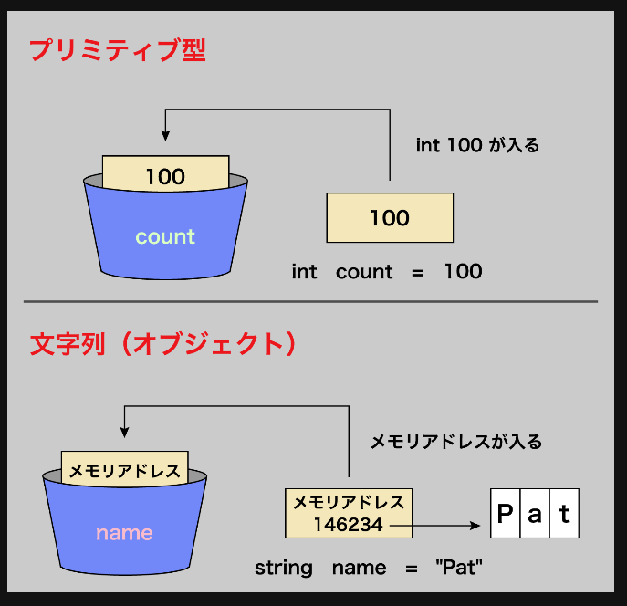

### オブジェクト

それぞれの特徴を指すものをインスタンス
各インスタンスを作成するために必要な情報をまとめたものをクラス
クラスを定義してプリミティブ型のデータを代入することで同一のオブジェクトでありながら異なる種類のデータを表現することが出来る。

#### クラス変数

- クラス内で定義される変数: メンバ変数
  メソッドからアクセス出来る変数
- メンバ変数の中でクラス内の全てのオブジェクトに対して共通する値を持つ変数: クラス変数
  クラス内の共通の変数
- 各オブジェクトのインスタンスごとに値が変わるメンバ変数: インスタンス変数

- オブジェクトを初期化するために使用される特別な種類の関数: コンストラクタ
  コンストラクタには返り値がない。オブジェクトを初期化するためだけに使用される

#### 文字列とオブジェクト

文字列はプリミティブ型ではなく、オブジェクトとして扱われる。
これは文字列は可変長である性質のためである。
プリミティブ型は固定サイズである。
また、オブジェクトはプリミティブ型とは異なり、メモリに格納される


**文字列がオブジェクトとして振る舞われる例(Python)**

```sandbox.py
#いつもの書き方
hoge = "hoge"
hoge.uppder() #HOGE

#実際のイメージ
hoge = Str("hoge) #Strクラスを自動で使っている感じ
hoge.upper() #HOGE #Strクラスのupperメソッドを使用
```

#### 可変オブジェクト(mutable)/不変オブジェクト(immutable)

**(例)Python**
リストはミュータブル
文字列はイミュータブル

リストであればインデックスを指定して値を変えることが出来るが文字列は出来ない。

C や C++は文字列が文字の配列として扱われるため、文字列もミュータブルである。

#### ステートレスオブジェクト

クラス内にデータを持たないオブジェクト
内部に状態を持たないため、予測可能で再利用可能なコードになる。
便利な関数などはステートレスオブジェクトで実装したい。

```sandbox.ts
//四則演算のステートレスオブジェクト
class Calculator {
    public static add(a: number, b: number): number {
        return a + b;
    }
    public static subtract(a: number, b: number): number {
        return a - b;
    }
    public static multiply(a: number, b: number): number {
        return a * b;
    }
    public static divide(a: number, b: number): number {
        if (b === 0) {
            throw new Error("Division by zero is not allowed.");
        }
        return a / b;
    }
}
```
